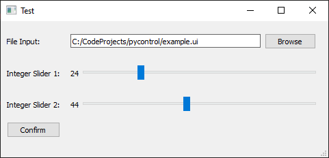

# Simple boilerplate UI using python and QT
This is a simple boilerplate UI project using python and QT.

## Prerequisite
* python3
* pyside2 (see installation below)

## Install
The recommended set up is using a python virtual environment.
1. Run ```python -m pip venv venv``` to create a virtual environment.
2. Activate the environment by running ```venv\Scripts\activate.bat```.
3. Install the dependencies by running ```python -m pip install -r requirements.txt```.

## Running the application
To run the application type ```python main.py```.

## Editing the UI
To edit the UI, (with the virtual environment activated), you can type ```pyside2-designer example.ui```. This will open up the QT designer tool that allows you to edit the ui file visually.